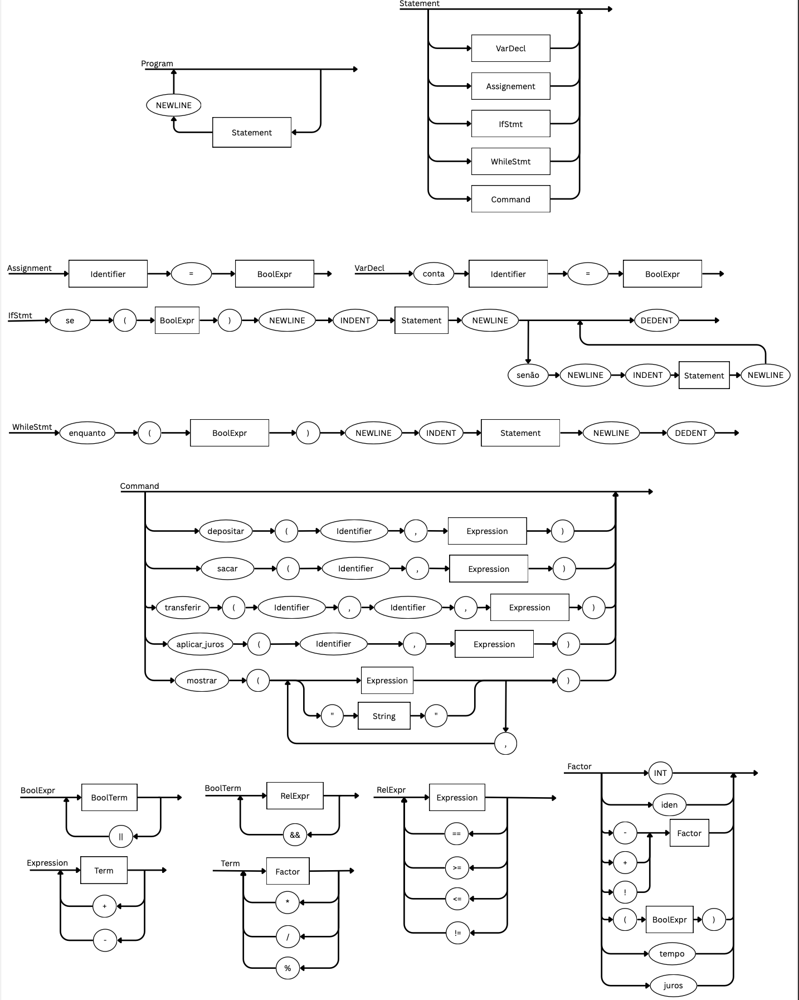

# MoneyLang e BankVM

## Visão Geral

MoneyLang é uma DSL para operações bancárias que agora possui um compilador escrito com Flex/Bison. O compilador gera Assembly para a BankVM, cujas instruções estão descritas em `docs/VM_SPEC.md`.

## Compilador MoneyLang

### Dependências
- GCC/Clang com suporte a C11
- Flex
- Bison

### Construção
```bash
make
```
O binário `bin/moneyc` será gerado junto com artefatos intermediários em `build/`.

### Uso
```bash
bin/moneyc programa.money -o saida.asm
```
Se `-o` não for indicado, o Assembly é impresso em `stdout`.

### Exemplo Rápido
```money
conta origem = 1000
conta destino = 0

enquanto (origem > 0)
    transferir(origem, destino, 100)

mostrar("saldo final", origem, destino)
```
```bash
bin/moneyc exemplo.money -o exemplo.asm
```

## Estrutura do Projeto
- `src/`: arquivos `.l`, `.y` e fontes em C (AST, codegen, main)
- `include/`: cabeçalhos compartilhados
- `docs/VM_SPEC.md`: especificação textual do Assembly da BankVM
- `Makefile`: recipes para gerar o compilador
- `AGENTS.md`: guia de contribuição

## EBNF da Linguagem

### 1) PROGRAMA, INSTRUÇÕES E DECLARAÇÕES

Program        = { Statement }

Statement     = VarDecl
              | Assignment
              | IfStmt
              | WhileStmt
              | Command ;
              
VarDecl       = "conta" Identifier "=" Expression ;

Assignment    = Identifier "=" Expression ;

### 2) BLOCO E CONTROLE DE FLUXO

IfStmt        = "se" "(" Condition ")" Newline
                IDENT { Statement Newline } DEDENT
                [ "senão" Newline
                  IDENT { Statement Newline } DEDENT ] ;

WhileStmt     = "enquanto" "(" Condition ")" Newline
                IDENT { Statement Newline } DEDENT ;
                
### 3) COMANDOS ESPECÍFICOS DA VM (BankVM)

Command       = DepositCmd
              | WithdrawCmd
              | TransferCmd
              | InterestCmd
              | PrintCmd ;

DepositCmd    = "depositar"  "(" Identifier "," Expression ")" ;

WithdrawCmd   = "sacar"      "(" Identifier "," Expression ")" ;

TransferCmd   = "transferir" "(" Identifier "," Identifier "," Expression ")" ;

InterestCmd   = "aplicar_juros" "(" Identifier "," Expression ")" ;

PrintCmd      = "mostrar" "(" PrintArg { "," PrintArg } ")" ;

PrintArg      = Expression | String ;

### 4) EXPRESSÕES (com precedência)

Expression    = Term { ("+" | "-") Term } ;

Term          = Factor { ("*" | "/" | "%") Factor } ;

Factor        = [ "!" | "-" ] Primary ;

Primary       = Number
              | Identifier
              | Sensor
              | "(" Expression ")" ;


### 5) CONDIÇÕES

Condition     = Expression ( "==" | "!=" | "<" | ">" | "<=" | ">=" ) Expression ;

### 6) SENSORES

Sensor        = "tempo" | "juros" ;

### 7) LÉXICO

Identifier    = Letter { Letter | Digit | "_" } ;

Number        = Digit { Digit } [ "." Digit { Digit } ] ;

String        = '"' { any-character-except-quote } '"' ;

Letter        = "a" | … | "z" | "A" | … | "Z" ;

Digit         = "0" | … | "9" ;

### 8) PALAVRAS-RESERVADAS

ReservedWord   = "conta" | "se" | "senão" | "enquanto"
               | "depositar" | "sacar" | "transferir" | "aplicar_juros"
               | "mostrar" | "tempo" | "juros"
               | "verdadeiro" | "falso" ;

               
## Diagrama Sintático

